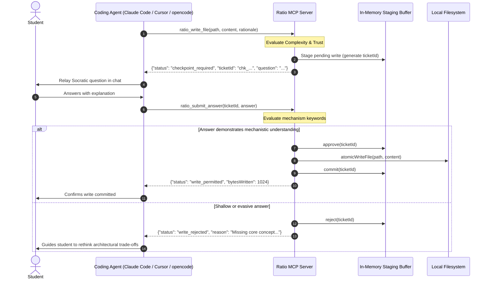

# Interception Protocol & Agent Integration Guide

## 1. Architectural Overview

Ratio is an architectural interceptor and Socratic mentor implemented as a **Model Context Protocol (MCP)** server. Instead of building a heavyweight custom agent harness or sandbox, Ratio leverages the fact that modern coding agents (Claude Code, Cursor, opencode, Cline) communicate with developer tools via the open MCP standard over `stdio` (JSON-RPC 2.0).

By routing file-writing operations through Ratio MCP tools rather than native write primitives, Ratio sits directly between the agent's intent and the physical filesystem:



---

## 2. The Interception Protocol Specification

### Tools Exposed

1. **`ratio_write_file`**:
   - `path`: Target file relative or absolute path.
   - `content`: Proposed file content.
   - `rationale` *(optional)*: Agent's explanation for the change.
2. **`ratio_edit_file`**:
   - `path`: Target file to modify.
   - `edits`: Array of `{ oldText, newText, startLine?, endLine? }`.
   - `rationale` *(optional)*: Explanation of the patch.
3. **`ratio_submit_answer`**:
   - `ticketId`: Unique checkpoint identifier from `checkpoint_required`.
   - `answer`: The student's plain-language response.

### Response Schemas

#### `checkpoint_required`
Returned when a write exceeds complexity thresholds or crosses architectural boundaries:
```json
{
  "status": "checkpoint_required",
  "ticketId": "chk_l9x1a2_3f8b",
  "file": "src/auth/middleware.ts",
  "question": "Socratic Checkpoint: Before Ratio permits writing to src/auth/middleware.ts, explain: why does the JWT secret need to live outside the codebase, and what happens if it doesn't?",
  "concept": "ARCHITECTURAL_RATIONALE",
  "rationale": "Add JWT verification middleware",
  "hint": "Explain the mechanism clearly in plain language without hand-waving.",
  "instruction": "Do not modify the file yet. Relay this question to the user and call ratio_submit_answer with this ticketId."
}
```

#### `write_permitted`
Returned when write is approved (or passes through trivial thresholds):
```json
{
  "status": "write_permitted",
  "file": "src/auth/middleware.ts",
  "bytesWritten": 1420,
  "message": "Write committed successfully."
}
```

#### `write_rejected`
Returned when an answer fails evaluation or is explicitly declined:
```json
{
  "status": "write_rejected",
  "ticketId": "chk_l9x1a2_3f8b",
  "file": "src/auth/middleware.ts",
  "reason": "Answer lacked required mechanism explanation."
}
```

---

## 3. Agent Integration & Configuration

To direct coding agents to use Ratio tools, configure the agent's MCP client and prompt rules:

### A. Claude Code

1. Register Ratio in `.claude/mcp.json` or project configuration:
   ```json
   {
     "mcpServers": {
       "ratio": {
         "command": "bun",
         "args": ["run", "/path/to/ratio/src/server/index.ts"]
       }
     }
   }
   ```
2. Include the provided [CLAUDE.md](file:///home/sanjayrohith/codes/ratio/templates/agent-rules/CLAUDE.md) in your project root.

### B. Cursor

1. Open **Cursor Settings > Features > MCP**.
2. Add a new MCP server:
   - **Name**: `ratio`
   - **Type**: `stdio`
   - **Command**: `bun run /path/to/ratio/src/server/index.ts`
3. Place [.cursorrules](file:///home/sanjayrohith/codes/ratio/templates/agent-rules/.cursorrules) in your repository root.

### C. opencode

1. Add the MCP server entry to `opencode.json`:
   ```json
   {
     "mcpServers": {
       "ratio": {
         "command": "bun",
         "args": ["run", "ratio"]
       }
     }
   }
   ```
2. Place [.opencode-rules.md](file:///home/sanjayrohith/codes/ratio/templates/agent-rules/opencode-rules.md) in the project workspace.

---

## 4. Staging and Atomicity Guarantees

1. **In-Memory Retention**: Proposed writes are buffered in memory (`StagingBuffer`). Files on disk remain completely unmodified until checkpoint resolution.
2. **Atomic Writes**: Approved writes execute via `atomicWriteFile`, writing to an isolated sibling temporary file before calling `fs.rename` for zero-corruption filesystem replacement.
3. **Rollback**: If a checkpoint is rejected, the staged entry is marked `rejected` and purged, leaving the target file untouched.
