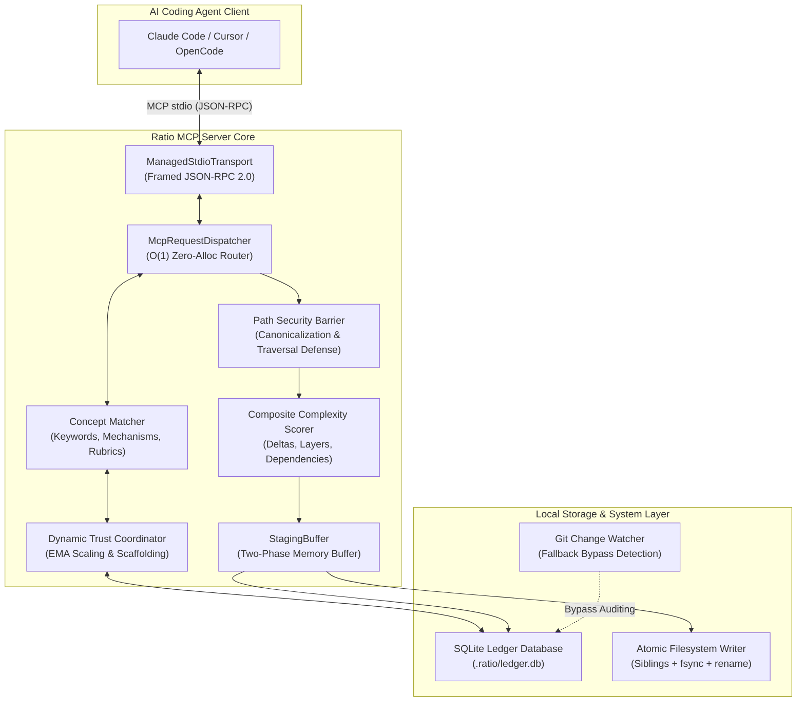
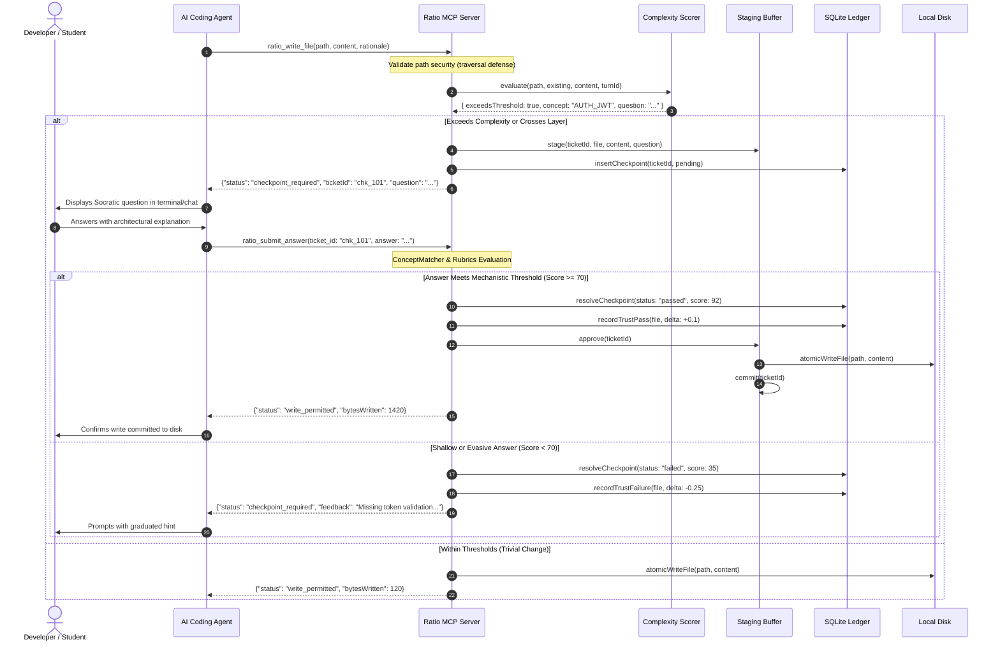
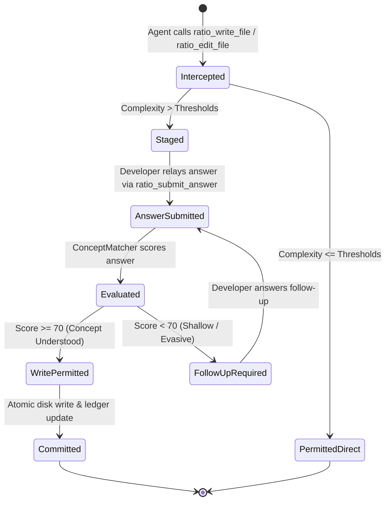

# Ratio Architecture Reference & System Overview

## 1. Executive Architecture Summary

**Ratio** is a lightweight, low-latency Model Context Protocol (MCP) server and developer tool designed to enforce intellectual ownership and architectural intentionality in AI-assisted software development. Rather than creating a bespoke agent harness or complex sandbox runtime, Ratio intercepts standard file modifications emitted by AI coding agents (Claude Code, Cursor, OpenCode, Cline) over JSON-RPC 2.0 stdio streams.

When an agent attempts a complex file creation or patch, Ratio holds the proposed change in an in-memory staging buffer and responds with a **Socratic Checkpoint**. The student or developer must explain the underlying architectural mechanism to release the write to the physical filesystem. Every interaction is recorded locally in a repo-scoped SQLite ledger (`.ratio/ledger.db`), producing an immutable audit trail and an exportable portfolio report for job interviews and academic vivas.

---

## 2. High-Level Component Topology

---

## 3. End-to-End Interception Sequence

The sequence below illustrates the complete workflow: Agent tool dispatch, heuristic scoring, Socratic questioning, user explanation, concept evaluation, ledger journaling, and atomic disk commit.

---

## 4. Subsystem Architecture

### 4.1 MCP Transport & Request Dispatcher

- **`ManagedStdioTransport`**: Implements framed JSON-RPC 2.0 over standard input and output streams. Stderr is dedicated exclusively to logging and debug output (`RatioLogger`) to ensure that JSON payloads on stdout are never corrupted.
- **`McpRequestDispatcher`**: Maintains pre-indexed, bound tool handlers in a `Map<string, ToolHandler>`. Avoids heap allocations on repetitive calls, supporting up to 500 dispatches/second with sub-millisecond dispatch overhead.
- **Tools Exposed**:
  1. `ratio_write_file`: Intercepts file creation and complete rewrites.
  2. `ratio_edit_file`: Intercepts chunked line edits (`applyEdits` with 1-based indexing).
  3. `ratio_submit_answer`: Validates student answers to pending tickets.

### 4.2 Heuristic Complexity Scorer & Pipeline

The scorer evaluates changes against five dimensions before any code touches the disk:
1. **Net Line Delta**: Quantifies lines added and removed using unified diff algorithms.
2. **Layer Categorization**: Classifies touched files into architectural layers (`schema`, `model`, `service`, `auth`, `api`, `ui`, `config`, `infra`).
3. **Layer Transition Tracking**: Detects when an agent transitions across architectural layers within a single turn or sequence of turns.
4. **Dependency Diffing**: Parses package manifests (`package.json`, `Cargo.toml`, `pyproject.toml`, `go.mod`) and flags any newly added third-party library.
5. **Fast-Path Early-Exit Bypasses**: Bypasses full scoring for zero-byte diffs, non-text media assets (PNG, SVG, WOFF2), and small edits on files with high trust scores (>0.85).

### 4.3 Staging Buffer & Two-Phase Commit

Unapproved writes are held strictly in memory in `StagingBuffer` keyed by UUID-based ticket IDs (`chk_<uuid>`).
- **Phase 1 (Staging)**: Content is buffered; filesystem remains pristine.
- **Phase 2 (Resolution)**: Upon approval, writes execute via `atomicWriteFile`, which writes to a temporary sibling file (`.file.tmp.<rand>`), syncs to disk (`fsync`), and renames atomically over the target.

### 4.4 Repository SQLite Ledger (`.ratio/ledger.db`)

All auditing state is encapsulated within the repository at `.ratio/ledger.db` using Bun's native SQLite driver (`bun:sqlite`):
- **`checkpoints`**: Stores every triggered checkpoint, question, student answer, concept score, and resolution status.
- **`pending_writes`**: Durable backup of uncommitted staging payloads.
- **`sessions`**: Tracks agent sessions with start/end timestamps and target features.
- **`trust_scores`**: Exponential moving average (EMA) of author comprehension per file path.
- **`file_summaries`**: Pre-aggregated metrics on files touched, lines written, and pass rates.

### 4.5 Security Barrier & Path Traversal Prevention

`validateSafeWritePath` canonicalizes every file target before processing:
- Blocks directory escapes (`../`, `../../../../`).
- Blocks null-byte injection (`safe.ts\0evil.sh`).
- Blocks symlinks pointing outside the workspace root.
- Strictly forbids writes into `.git/` or repository internal metadata directories.

---

## 5. Checkpoint State Machine

---

## 6. Performance & Latency SLA

| Operation | Budget / Target | Observed Benchmark |
| :--- | :--- | :--- |
| **Early-Exit Trivial Write** | `< 5.0ms` | `~0.8ms - 1.5ms` |
| **Full Scoring & Checkpoint Trigger** | `< 25.0ms` | `~4.0ms - 8.0ms` |
| **End-to-End Interception SLA** | `< 50.0ms` | `~6.5ms median` |
| **High-Throughput Dispatching** | `> 200 ops/sec` | `> 450 ops/sec` |
